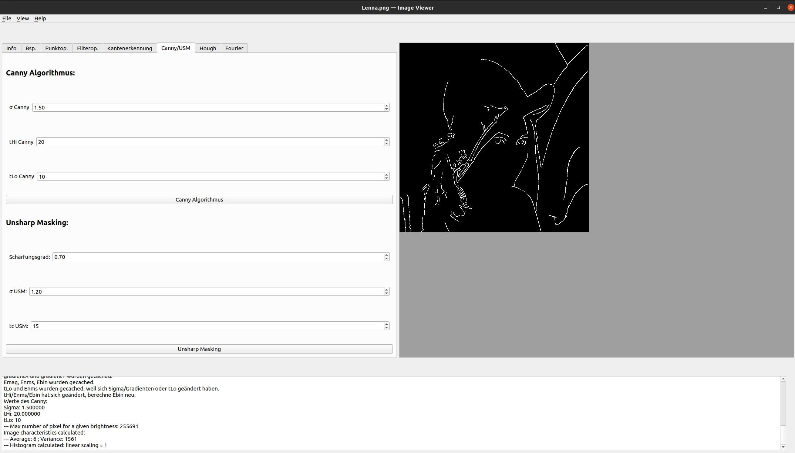
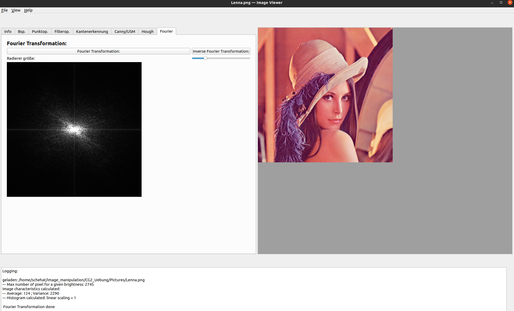

# image_manipulation
Assignments during the computer graphics course to implement preprocessing algorithms of image manipulation to detect objects in images used by libraries such as OpenCV, e.g. the Canny algorithm.

Runs on Ubuntu 20.04

Run Manual:

- following packets need to be installed
  - g++
  - libglm-dev
  - qt5-default (optional)
  - qtcreator (optional)
- Commands typed in terminal
  - make clean
  - qmake
  - make
  - ./CgViewer
